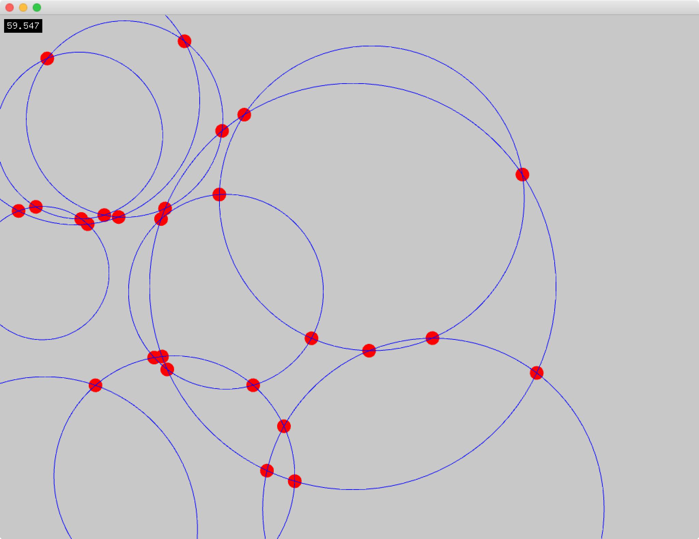
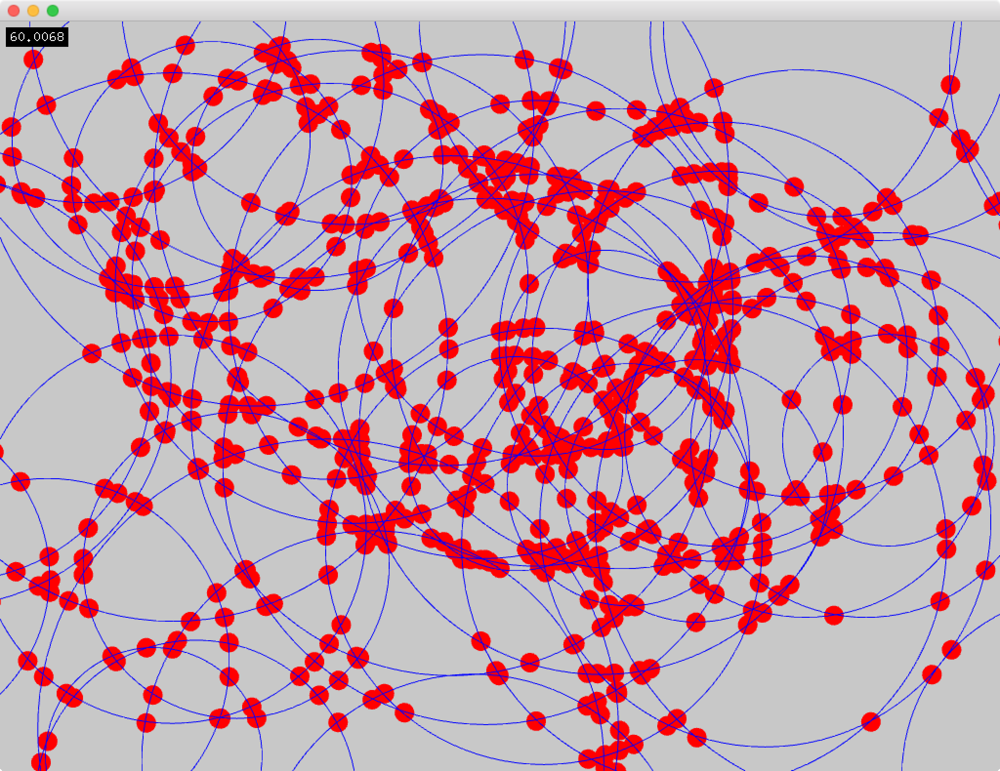
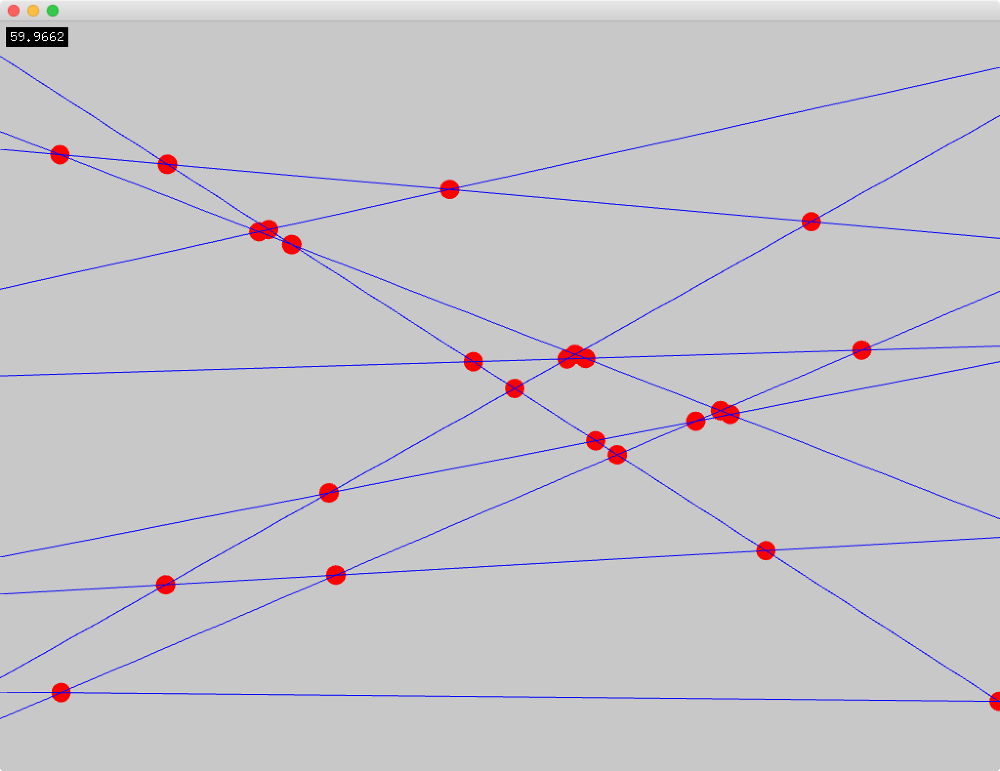
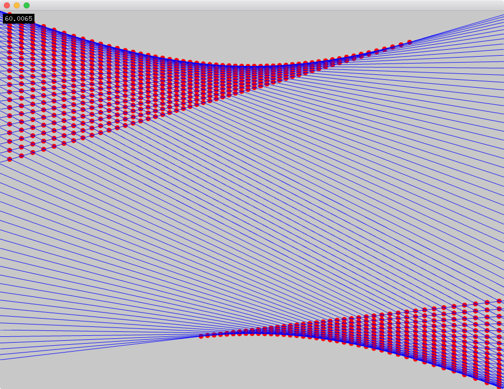
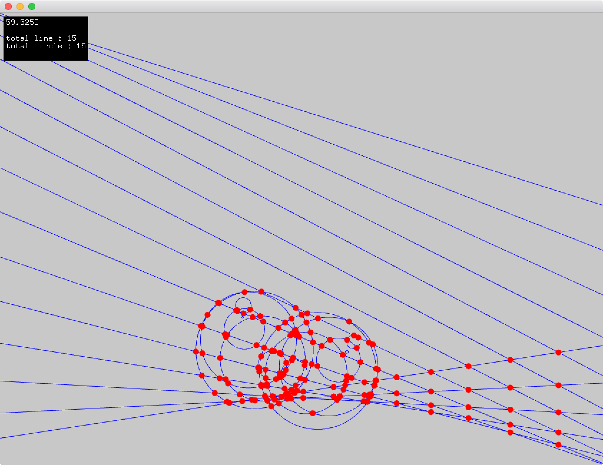

# Introduction
This addon can get the intersections(2D).

# Compatibility
oF 0.9.8

# Installation

Copy to your openFrameworks/addons folder.

# Dependencies
None

# Licence
The code in this repository is available under the [MIT License](https://en.wikipedia.org/wiki/MIT_License).

Copyright (c) 2018 Shohei Fujimoto
